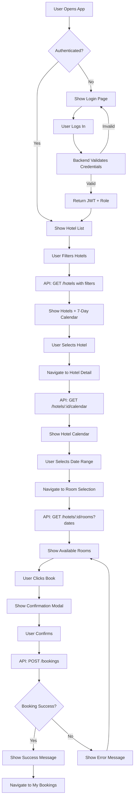
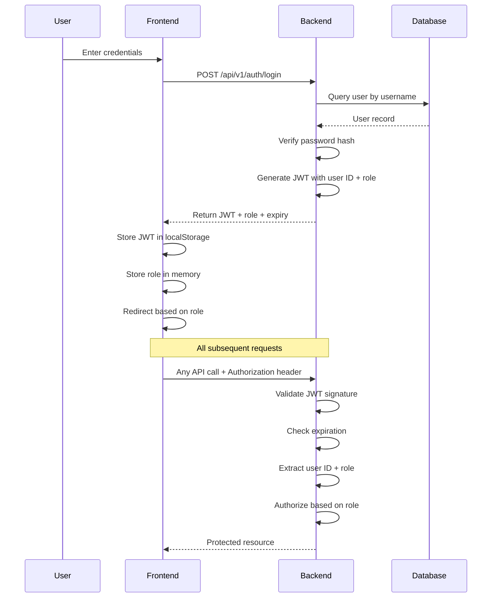
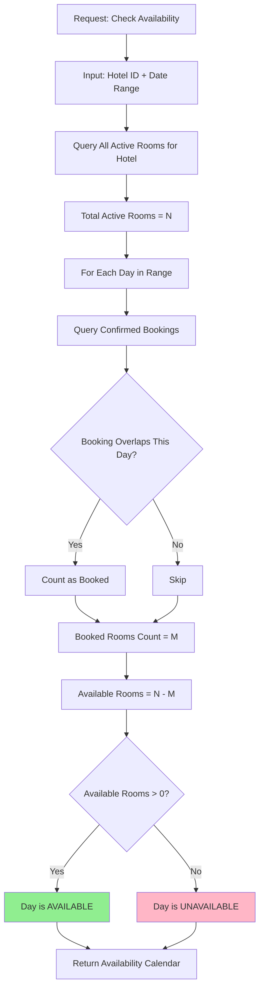
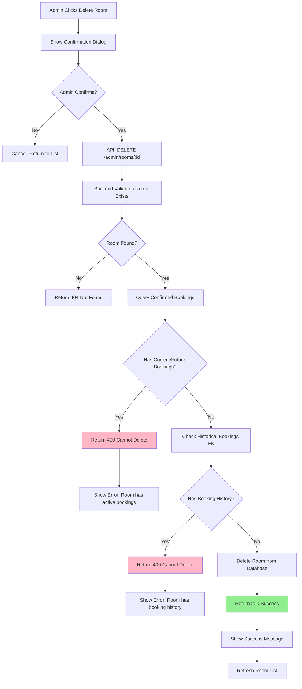
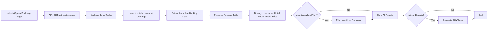
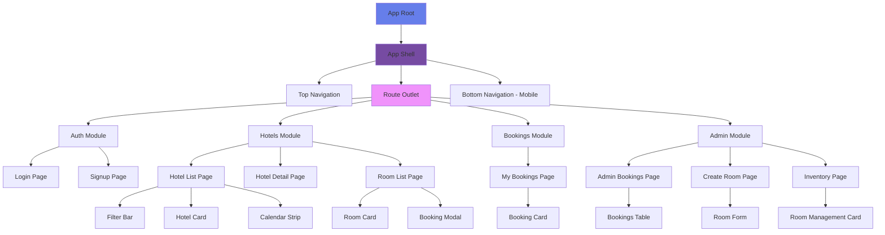
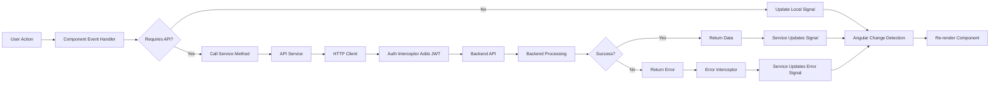
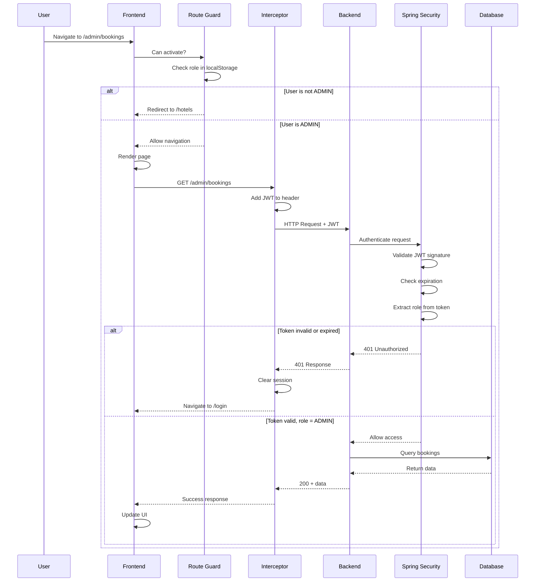
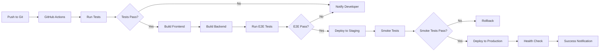

# Architecture Documentation

## Table of Contents

1. [System Overview](#system-overview)
2. [Architecture Decisions](#architecture-decisions)
3. [System Flows](#system-flows)
4. [Component Architecture](#component-architecture)
5. [Data Flow](#data-flow)
6. [Security Architecture](#security-architecture)
7. [Extensibility & Future Enhancements](#extensibility--future-enhancements)
8. [Performance Considerations](#performance-considerations)
9. [Deployment Architecture](#deployment-architecture)

---

## System Overview

### Purpose

This hotel booking system is a full-stack web application that enables users to browse hotels, check real-time availability, and make bookings. It implements role-based access control with two distinct user experiences: standard users who book rooms and administrators who manage the entire system.

### Technology Stack

**Backend**:
- **Java 17** - Modern LTS version with performance improvements and language features
- **Spring Boot 3.3.5** - Latest stable framework for rapid development and production-ready features
- **Spring Security + JWT** - Stateless authentication with industry-standard token-based security
- **PostgreSQL** - Robust relational database with strong ACID compliance
- **Flyway** - Version-controlled database migrations for consistent schema management
- **Maven** - Dependency management and build automation

**Frontend**:
- **Angular 17+** - Modern framework with standalone components and signals
- **TypeScript 5+** - Type safety and enhanced developer experience
- **Tailwind CSS 3+** - Utility-first CSS for rapid UI development
- **RxJS** - Reactive programming for async operations
- **Angular Signals** - Fine-grained reactivity for state management

### Key Features

**For Users**:
- Secure authentication with JWT tokens
- Browse hotels with visual 7-day availability calendars
- Filter hotels by location (state/city)
- View detailed room availability for specific date ranges
- Create bookings with instant confirmation
- Access personal booking history

**For Administrators**:
- View all system bookings across all users
- Create new rooms under existing hotels
- Delete rooms with booking-based safeguards
- Manage inventory without direct database access

---

## Architecture Decisions

### 1. Stateless Authentication with JWT

**Decision**: Use JSON Web Tokens (JWT) for authentication instead of session-based authentication.

**Rationale**:
- **Scalability**: Stateless tokens enable horizontal scaling without session synchronization
- **Mobile-Friendly**: Tokens work seamlessly across web and mobile clients
- **Microservices Ready**: No shared session store required for distributed systems
- **Performance**: No database lookup on every request after initial authentication

**Implementation**:
- Tokens include user ID and role claims
- Tokens expire after a configurable period (default: 60 minutes)
- Frontend stores tokens in localStorage and includes them in Authorization headers
- Backend validates tokens on protected endpoints using Spring Security filters

**Trade-offs**:
- Cannot immediately revoke tokens (must wait for expiration)
- Token size is larger than session IDs
- Requires secure token storage on client

---

### 2. Database-First Availability Logic

**Decision**: Calculate room availability exclusively from the `bookings` table, ignoring legacy `room.isBooked` and `room.bookedDate` fields.

**Rationale**:
- **Single Source of Truth**: All availability queries reference actual booking records
- **Accuracy**: Prevents synchronization issues between room flags and booking data
- **Flexibility**: Supports overlapping date ranges and complex availability queries
- **Audit Trail**: Complete booking history is preserved

**Implementation**:
```sql
-- Overlap detection logic
WHERE existing.checkInDate < requested.checkOutDate
  AND existing.checkOutDate > requested.checkInDate
  AND booking.status = 'CONFIRMED'
```

**Daily Calendar Logic**:
- For each date in the requested range, count rooms with overlapping confirmed bookings
- Available rooms = Total active rooms - Booked rooms for that day
- A day is available if at least one room is free

**Trade-offs**:
- More complex queries than simple boolean flags
- Requires proper indexing on booking dates for performance
- Legacy fields still exist for backward compatibility

---

### 3. Three-Tier Frontend Architecture

**Decision**: Implement a layered frontend with clear separation between presentation, logic, and data.

**Layers**:

```
┌─────────────────────────────────────────┐
│  Presentation Layer                     │
│  (Components, Templates, Styles)        │
└─────────────────────────────────────────┘
                 ↓
┌─────────────────────────────────────────┐
│  Business Logic Layer                   │
│  (Services, State Management, Guards)   │
└─────────────────────────────────────────┘
                 ↓
┌─────────────────────────────────────────┐
│  Data Access Layer                      │
│  (API Services, Interceptors, Models)   │
└─────────────────────────────────────────┘
```

**Rationale**:
- **Maintainability**: Changes to UI don't affect business logic
- **Testability**: Each layer can be tested independently
- **Reusability**: Services and components can be shared across features
- **Clear Contracts**: Well-defined interfaces between layers

**Implementation**:
- **Presentation**: Dumb components that receive data via inputs and emit events
- **Business Logic**: Smart containers that orchestrate data fetching and state
- **Data Access**: API services that handle HTTP and error mapping

---

### 4. Signal-Based Reactivity

**Decision**: Use Angular Signals for local component state instead of traditional RxJS Observables everywhere.

**Rationale**:
- **Performance**: Fine-grained reactivity updates only what changed
- **Simplicity**: Easier to reason about than complex Observable chains
- **Developer Experience**: Less boilerplate than manual subscription management
- **Future-Proof**: Angular's recommended approach for state management

**When to Use Each**:
- **Signals**: Component local state, derived computations, UI state
- **RxJS**: HTTP requests, event streams, async operations with operators

**Example**:
```typescript
// Signal for UI state
private isLoadingSignal = signal(false);
readonly isLoading = this.isLoadingSignal.asReadonly();

// RxJS for HTTP
loadHotels(): void {
  this.isLoadingSignal.set(true);
  this.hotelsApi.getHotels(filters)
    .pipe(takeUntilDestroyed(this.destroyRef))
    .subscribe({
      next: (hotels) => {
        this.hotelsSignal.set(hotels);
        this.isLoadingSignal.set(false);
      },
      error: (err) => {
        this.errorSignal.set(err);
        this.isLoadingSignal.set(false);
      }
    });
}
```

---

### 5. Mobile-First Responsive Design

**Decision**: Design for mobile screens first, then progressively enhance for larger displays.

**Rationale**:
- **User Behavior**: Majority of hotel bookings happen on mobile devices
- **Performance**: Mobile-first forces performance optimization from the start
- **Constraints Drive Design**: Designing for small screens creates cleaner interfaces
- **Progressive Enhancement**: Easier to add features than remove them

**Breakpoint Strategy**:
```css
/* Mobile First (Default) */
.container { flex-direction: column; }

/* Tablet (768px+) */
@media (min-width: 768px) {
  .container { flex-direction: row; }
}

/* Desktop (1024px+) */
@media (min-width: 1024px) {
  .container { max-width: 1200px; margin: 0 auto; }
}
```

**Layout Adaptations**:
- Mobile: Single column, bottom navigation, hamburger menu
- Tablet: 2-column grids, collapsible side navigation
- Desktop: Multi-column layouts, persistent navigation

---

### 6. Role-Based Access Control (RBAC)

**Decision**: Implement role-based permissions at both frontend and backend layers.

**Rationale**:
- **Security**: Backend enforcement prevents unauthorized access even if frontend is bypassed
- **User Experience**: Frontend enforcement provides immediate feedback and cleaner UI
- **Flexibility**: Easy to add new roles or modify permissions

**Implementation**:

**Backend** (Spring Security):
```java
@PreAuthorize("hasRole('ADMIN')")
@PostMapping("/admin/hotels/{hotelId}/rooms")
public ResponseEntity<RoomResponse> createRoom(...) { ... }
```

**Frontend** (Route Guards):
```typescript
export const adminGuard: CanActivateFn = (route, state) => {
  const role = localStorage.getItem('user_role');
  if (role !== 'ADMIN') {
    router.navigate(['/app/hotels']);
    return false;
  }
  return true;
};
```

**Role Matrix**:

| Endpoint | USER | ADMIN |
|----------|------|-------|
| Browse Hotels | ✓ | ✓ |
| View Rooms | ✓ | ✓ |
| Create Booking | ✓ | ✗ |
| View Own Bookings | ✓ | ✓ |
| View All Bookings | ✗ | ✓ |
| Create Room | ✗ | ✓ |
| Delete Room | ✗ | ✓ |

---

### 7. Error Handling Strategy

**Decision**: Implement layered error handling with user-friendly messages and developer details.

**Layers**:

1. **Backend Validation**: Catch business logic errors, return structured responses
2. **HTTP Interceptor**: Catch network errors, handle 401 unauthorized globally
3. **Service Layer**: Map backend errors to domain-specific error types
4. **Component Layer**: Display appropriate UI (inline error, toast, modal)

**Error Response Structure**:
```json
{
  "timestamp": "2026-05-04T10:08:08.214530Z",
  "status": 400,
  "error": "Booking failed",
  "details": [
    "Room is already booked for selected dates"
  ]
}
```

**User-Facing vs Developer-Facing**:
- **User**: "Please try again!!" (simple, non-technical)
- **Developer**: Full error details in console and detailed logs

---

## System Flows

### User Booking Flow



### Authentication Flow



### Availability Calculation Flow



### Room Deletion Validation Flow



### Admin Booking Report Flow



---

## Component Architecture

### Frontend Component Hierarchy



### Shared Component Library

**Base Components** (Presentational, No Business Logic):
- `Button` - Primary, secondary, ghost, icon variants
- `Card` - Container with consistent styling and shadows
- `Modal` - Overlay with backdrop and animations
- `Badge` - Status indicators with color variants
- `Spinner` - Loading indicator
- `Toast` - Notification messages
- `FormInput` - Text, email, password inputs with validation states
- `Select` - Dropdown with search
- `DatePicker` - Calendar-based date selection

**Domain Components** (Feature-Specific):
- `HotelCard` - Displays hotel with calendar and pricing
- `CalendarStrip` - 7-day horizontal availability calendar
- `RoomCard` - Room details with features and availability
- `BookingCard` - Booking history item
- `FilterBar` - Hotel search and filter controls

---

## Data Flow

### State Management Strategy

**Local Component State** (Signals):
```typescript
// Example: Hotel List Component
private hotelsSignal = signal<Hotel[]>([]);
private loadingSignal = signal(false);
private errorSignal = signal<string | null>(null);

// Computed derived state
readonly availableHotels = computed(() => 
  this.hotelsSignal().filter(h => h.availableRooms > 0)
);
```

**Global Session State** (Service + Signals):
```typescript
// Auth Service
private tokenSignal = signal<string | null>(null);
private roleSignal = signal<UserRole | null>(null);

readonly isAuthenticated = computed(() => this.tokenSignal() !== null);
readonly isAdmin = computed(() => this.roleSignal() === 'ADMIN');
```

**HTTP State** (RxJS Observables):
```typescript
// API Service
getHotels(filters: HotelFilters): Observable<Hotel[]> {
  return this.http.get<Hotel[]>('/api/v1/hotels', { params: filters })
    .pipe(
      catchError(this.handleError),
      shareReplay(1) // Cache for multiple subscribers
    );
}
```

### Data Flow Diagram



---

## Security Architecture

### Defense in Depth

**Layer 1: Frontend Validation**
- Input sanitization
- Client-side validation (immediate feedback)
- Route guards prevent unauthorized navigation
- Role-based UI hiding (cosmetic, not security)

**Layer 2: Network Security**
- HTTPS in production
- CORS configuration restricts origins
- JWT in Authorization header (not URL)
- Token expiration enforced

**Layer 3: Backend Authorization**
- Spring Security filters on all endpoints
- Role-based method security (`@PreAuthorize`)
- JWT signature validation
- Input validation with Bean Validation

**Layer 4: Database Security**
- Prepared statements (prevent SQL injection)
- Foreign key constraints
- Database user with minimal privileges
- Password hashing with BCrypt

### Security Flow



### Password Security

**Backend**:
- Passwords hashed with BCrypt (salt + iterations)
- Plaintext passwords never stored or logged
- Password validation: 6+ chars, alphanumeric requirement

**Frontend**:
- Password input type="password" (masked)
- Validation hints shown during typing
- Password confirmation on signup

---

## Extensibility & Future Enhancements

### Architecture Supports These Extensions

#### 1. Payment Integration

**Current State**: Bookings are confirmed immediately without payment.

**Extension Path**:
- Add `payment_status` field to bookings table
- Create `payments` table with transaction records
- Integrate Stripe/PayPal API
- Update booking status flow: `PENDING` → `PAID` → `CONFIRMED`
- Frontend: Add payment form in booking modal

**Required Changes**:
- Database migration: Add payment fields
- New service: `PaymentService`
- New API endpoints: `/api/v1/payments`
- Frontend: Payment form component

---

#### 2. Email Notifications

**Extension Path**:
- Integrate SendGrid/AWS SES
- Create email templates (booking confirmation, reminders)
- Add async job queue (Spring @Async or RabbitMQ)
- Send emails on: booking creation, check-in reminder, cancellation

**Required Changes**:
- New service: `EmailService`
- Email templates (HTML + plain text)
- Configuration: SMTP credentials
- Optional: Event-driven architecture with message queue

---

#### 3. Booking Cancellation

**Extension Path**:
- Add `CANCELLED` status to `BookingStatus` enum
- Create endpoint: `PATCH /api/v1/bookings/:id/cancel`
- Implement cancellation policy (e.g., free cancellation 24hrs before)
- Frontend: Cancel button on booking cards

**Required Changes**:
- Update booking entity and service
- Add cancellation policy logic
- Frontend: Cancel confirmation modal
- Email notification on cancellation

---

#### 4. Multi-Image Support for Hotels/Rooms

**Current State**: Single image or placeholder per hotel/room.

**Extension Path**:
- Create `hotel_images` and `room_images` tables
- Store images in S3/CloudFront or local file storage
- Return image URLs in API responses
- Frontend: Image carousel component

**Required Changes**:
- Database: New tables for images
- File upload endpoints
- Image processing service (resize, optimize)
- Frontend: Image upload form, carousel viewer

---

#### 5. Review & Rating System

**Extension Path**:
- Create `reviews` table (user_id, hotel_id, rating, comment)
- Add average rating to hotel entity
- Create endpoints: POST /reviews, GET /hotels/:id/reviews
- Frontend: Review form, star rating component, review list

**Required Changes**:
- Database migration: reviews table
- Review service with moderation
- API endpoints for CRUD operations
- Frontend: Rating stars, review cards

---

#### 6. Real-Time Availability Updates

**Extension Path**:
- Implement WebSocket connection
- Backend: Spring WebSocket support
- Broadcast availability changes to all connected clients
- Frontend: Subscribe to availability events, update UI reactively

**Required Changes**:
- Add WebSocket dependencies
- Create WebSocket controller and message broker
- Frontend: WebSocket service
- Handle concurrent booking race conditions

---

#### 7. Multi-Language Support (i18n)

**Extension Path**:
- Use Angular i18n or ngx-translate
- Create translation files (JSON) for each language
- Detect user locale or provide language selector
- Translate UI labels, messages, and error text

**Required Changes**:
- Translation files for each language
- Update components to use translation keys
- Language selector in top navigation
- Store user preference

---

#### 8. Advanced Search & Filters

**Current State**: Basic filter by state/city.

**Extension Path**:
- Add filters: price range, amenities, star rating, distance from landmark
- Full-text search on hotel name and description
- Sort options: price, rating, availability
- Save search preferences

**Required Changes**:
- Backend: Enhanced query builder, possibly Elasticsearch
- Frontend: Advanced filter panel, sorting controls
- Performance: Indexing and caching

---

#### 9. Analytics Dashboard (Admin)

**Extension Path**:
- Track metrics: bookings per day, revenue, occupancy rate
- Create charts: line graphs, bar charts, pie charts
- Filter by date range and hotel
- Export reports

**Required Changes**:
- Analytics service and queries
- New endpoints: `/api/v1/admin/analytics`
- Frontend: Chart.js or ApexCharts integration
- Admin analytics page

---

#### 10. Mobile App (React Native / Flutter)

**Extension Path**:
- Reuse existing backend APIs (already RESTful)
- Build mobile UI with native components
- Implement biometric authentication
- Push notifications for booking updates

**Required Changes**:
- Mobile app codebase (separate repository)
- Mobile-specific endpoints if needed (optimized payloads)
- Push notification service (Firebase Cloud Messaging)

---

### Database Schema Extensibility

**Current Schema** supports:
- Adding new fields without breaking existing queries
- Foreign key relationships for data integrity
- Soft deletes (add `deleted_at` timestamp)
- Audit trails (add `created_at`, `updated_at`, `updated_by`)

**Example Extension - Add Audit Fields**:
```sql
ALTER TABLE bookings ADD COLUMN created_at TIMESTAMP DEFAULT CURRENT_TIMESTAMP;
ALTER TABLE bookings ADD COLUMN updated_at TIMESTAMP DEFAULT CURRENT_TIMESTAMP;
ALTER TABLE bookings ADD COLUMN updated_by VARCHAR(80);
```

---

## Performance Considerations

### Backend Optimizations

**Database Indexing**:
```sql
-- Booking lookups by user
CREATE INDEX idx_bookings_user_id ON bookings(user_id);

-- Availability queries by hotel and dates
CREATE INDEX idx_bookings_hotel_dates ON bookings(hotel_id, check_in_date, check_out_date);

-- Room lookups
CREATE INDEX idx_rooms_hotel_id ON rooms(hotel_id);
```

**Query Optimization**:
- Use pagination for large result sets
- Fetch only required columns (projection)
- Use JOIN instead of N+1 queries
- Cache frequent queries (Spring Cache with Redis)

**Connection Pooling**:
- HikariCP (default in Spring Boot) with tuned pool size
- Typical settings: max 10-20 connections

---

### Frontend Optimizations

**Lazy Loading**:
```typescript
// app.routes.ts
{
  path: 'admin',
  loadChildren: () => import('./features/admin/admin.routes')
}
```

**Image Optimization**:
- Use WebP format with JPEG fallback
- Responsive images with srcset
- Lazy load images (loading="lazy")
- CDN for static assets

**Request Optimization**:
- Debounce filter inputs (300ms)
- Cancel pending requests on navigation
- Cache hotel list in service (shareReplay)
- Prefetch likely next routes

**Bundle Size**:
- Tree shaking (remove unused code)
- Code splitting by route
- Minimize dependencies
- Use production build (`ng build --prod`)

---

### Caching Strategy

**Backend Caching**:
```java
@Cacheable(value = "hotels", key = "#state + '-' + #city")
public List<Hotel> findHotels(String state, String city) { ... }
```

**Frontend Caching**:
```typescript
// Cache hotel list for 5 minutes
private hotelCacheSubject = new ReplaySubject<Hotel[]>(1);
private cacheExpiry = 5 * 60 * 1000; // 5 minutes

getHotels(): Observable<Hotel[]> {
  if (this.isCacheValid()) {
    return this.hotelCacheSubject.asObservable();
  }
  return this.http.get<Hotel[]>('/api/v1/hotels').pipe(
    tap(hotels => this.hotelCacheSubject.next(hotels))
  );
}
```

**HTTP Caching**:
- Set `Cache-Control` headers for static resources
- ETags for conditional requests
- Service worker for offline support (PWA)

---

## Deployment Architecture

### Local Development

```
┌─────────────────┐      ┌─────────────────┐
│   Angular Dev   │      │   Spring Boot   │
│   Server        │─────▶│   (Port 8080)   │
│   (Port 4200)   │      └─────────────────┘
└─────────────────┘               │
                                  ▼
                         ┌─────────────────┐
                         │   PostgreSQL    │
                         │   (Port 5432)   │
                         └─────────────────┘
```

**Setup**:
1. Start PostgreSQL database
2. Run Spring Boot backend: `./mvnw spring-boot:run`
3. Run Angular frontend: `ng serve`
4. Access at `http://localhost:4200`

---

### Production Deployment

```
┌─────────────────────────────────────────────────────┐
│                    Cloudflare CDN                   │
│                  (Static Assets)                    │
└─────────────────────────────────────────────────────┘
                         │
                         ▼
┌─────────────────────────────────────────────────────┐
│                  Load Balancer                      │
│                  (HTTPS, SSL)                       │
└─────────────────────────────────────────────────────┘
           │                              │
           ▼                              ▼
┌──────────────────┐          ┌──────────────────┐
│  Frontend (SPA)  │          │  Backend (API)   │
│  Netlify/Vercel  │          │  AWS EC2/ECS     │
│  Static Hosting  │          │  Docker Container│
└──────────────────┘          └──────────────────┘
                                       │
                                       ▼
                              ┌──────────────────┐
                              │   PostgreSQL     │
                              │   RDS/Managed    │
                              └──────────────────┘
```

**Frontend Hosting Options**:
- **Netlify**: Automatic deploys from Git, CDN, free SSL
- **Vercel**: Similar to Netlify with excellent DX
- **AWS S3 + CloudFront**: More control, cost-effective at scale

**Backend Hosting Options**:
- **AWS EC2**: Full control, manually managed
- **AWS ECS/Fargate**: Container orchestration, auto-scaling
- **Heroku**: Simple deployment, limited free tier
- **DigitalOcean App Platform**: Balanced cost and features

**Database Hosting**:
- **AWS RDS**: Managed PostgreSQL with backups
- **Supabase**: PostgreSQL with built-in features
- **ElephantSQL**: Dedicated PostgreSQL hosting
- **Neon**: Serverless PostgreSQL

---

### CI/CD Pipeline



**GitHub Actions Example**:
```yaml
name: CI/CD Pipeline
on: [push, pull_request]

jobs:
  backend:
    runs-on: ubuntu-latest
    steps:
      - uses: actions/checkout@v3
      - name: Set up JDK 17
        uses: actions/setup-java@v3
        with:
          java-version: '17'
      - name: Build with Maven
        run: ./mvnw clean package
      - name: Run Tests
        run: ./mvnw test
  
  frontend:
    runs-on: ubuntu-latest
    steps:
      - uses: actions/checkout@v3
      - name: Setup Node
        uses: actions/setup-node@v3
        with:
          node-version: '18'
      - name: Install Dependencies
        run: npm ci
      - name: Build
        run: npm run build:prod
      - name: Run Tests
        run: npm run test:ci
```

---

### Environment Configuration

**Backend** (`application.yml`):
```yaml
spring:
  profiles:
    active: ${SPRING_PROFILE:local}

---
spring:
  config:
    activate:
      on-profile: local
  datasource:
    url: jdbc:postgresql://localhost:5432/summit_project

---
spring:
  config:
    activate:
      on-profile: prod
  datasource:
    url: ${DATABASE_URL}
```

**Frontend** (`environment.ts`):
```typescript
export const environment = {
  production: false,
  apiUrl: 'http://localhost:8080'
};

// environment.prod.ts
export const environment = {
  production: true,
  apiUrl: 'https://api.yourhotel.com'
};
```

---

## Conclusion

This architecture provides a solid foundation for a production-ready hotel booking system while maintaining flexibility for future enhancements. The separation of concerns, clear data flows, and extensibility points ensure the system can grow with changing business requirements.

**Key Strengths**:
- Scalable stateless authentication
- Accurate availability logic
- Clear separation of concerns
- Mobile-first responsive design
- Role-based security at all layers
- Performance optimization built-in

**Future-Ready**:
- Easy to add payment processing
- Supports notification systems
- Can scale horizontally
- Ready for mobile app integration
- Extensible database schema
